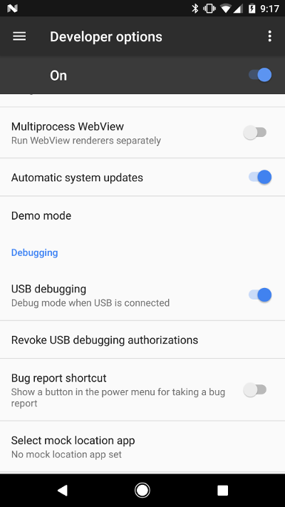

# Building NetAngel

The easiest way to build the app is to do so from Android Studio, since they now package the Android SDK with it.

### Enabling your device for debugging

Before you can build the app, you will need to get your phone set up to connect to the computer.

1. Open up `System Settings` -> `About Phone`
2. Tap the `Build number` preference 7 times to enable "Developer Mode"
3. Go back to the root of `System Settings` and you will now see a `Developer Options` section.
4. In `Developer Options`, make sure it is turned on, then make sure the `USB debugging` preference is turned on.



### Building the App in Android Studio

1. Install [Android Studio](https://developer.android.com/studio/index.html).
2. Install [Java 8](http://www.oracle.com/technetwork/java/javase/downloads/jdk8-downloads-2133151.html). Java 8 is necessary since we are building against Android 7.1 (SDK 25).
3. Open up Android Studio and open the root NetAngel [build.gradle](../build.gradle) file.
4. It will take a few minutes for Android Studio to prepare, index, and download the dependencies for the project.
5. In the toolbar on the very left side, open up the [Build Variants](build_variants.png) tab and select `prodDebug` for the app.
6. Connect your device to the computer via USB.
6. In the bar at the top, you will see a dropdown that says "App". Hit the [green play button](play_button.png) next to it.

This will build the app and send it to your device for testing.

### Building the app from the command line

1. Open the project in Android Studio, and it should generate a `local.properties` file for you, that has the path to the Android SDK
2. From the command line, inside the project, execute `$ ./gradle assembleProdDebug`.
3. This will generate a `.apk` file that you can copy to, and install on your device. The `.apk` will be `app/build/outputs/apk/app-prod-debug.apk`.

## Building a Play Store ready version

The signing configuration and keystore file, used on the release version of the app, should not be checked in to this repository, but if you have them locally, you can build a release-ready version of the app with:

```
$ ./gradle assembleProdRelease
```

The output file will be `app/build/outputs/apk/app-prod-release.apk`. This file can be uploaded to the Play Store.

#### Applying the signing configuration

The app is set up to be able to build both release and debug builds, without having to go in and remove your signing configuration, or worry about accidentally checking harmful files into the open-source repository.

To set up the signing config for a release build, on a local machine, or on a CI server:

1. Copy the `keystore.jks` to the root of the project directory. Note that it will not be added to the repo, because it is ignored with `*.jks`, within the `.gitignore`.
2. Create a new file, named `keystore.properties` in the root of the project directory, and copy the contents of `keystore.properties.example` into the `keystore.properties` file.
3. Replace the `<insert...>` sections with the signing configuration that is used on the keystore.

The final `keystore.properties` will look something like:

```
keystorefile=keystore.jks
keystorepassword=dummy_password
keyalias=my_key_alias
keypassword=another_dummy_password
```

Once that is set up, you should be able to generate the `app-prod-release.apk` file, as described above.
